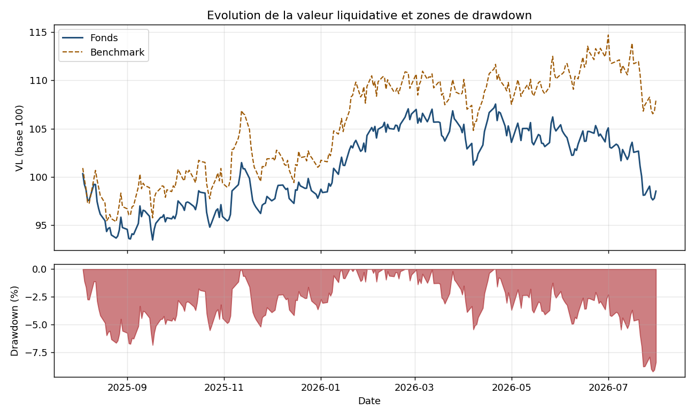
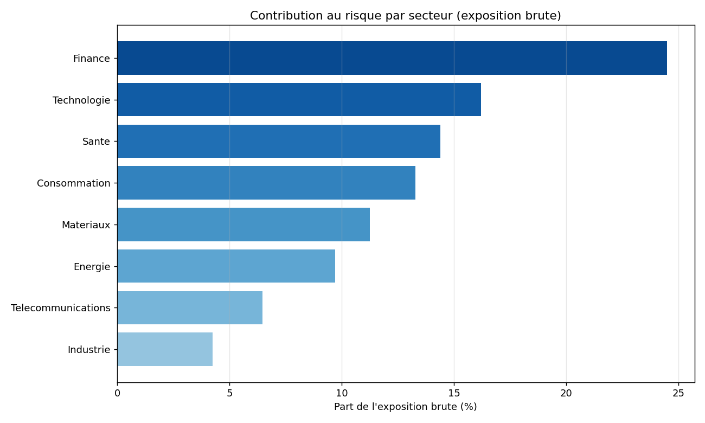

# VBA / Excel Risk Reporting

**Boite a outils middle-office risque : reporting Excel piloté par formules natives, 20 UDF VBA (VaR, ES, Grecques options), et un moteur Python de generation / validation croisee.**

   

---

## Ce que fait le projet

Le middle-office risque d'une société de gestion tourne, au quotidien, sous Excel + VBA + Bloomberg : calculer une VaR, contrôler des limites d'exposition, mettre à jour un classeur avec des formules qui ne cassent pas, retrouver une volatilité implicite à la main quand le pricer ne répond plus. Ce dépôt fournit cette boîte à outils : des UDF VBA de qualité production (gestion d'erreur propre, `Option Explicit`, aucune dépendance cachée), un classeur de reporting généré avec des formules Excel natives vivantes (pas des valeurs figées), et un moteur Python qui produit l'exemple et valide chaque indicateur en double aveugle contre le VBA.

---

## Structure du dépôt

```
vba-excel-risk-reporting/
├── vba/                        # Modules VBA (a importer dans Excel, voir ci-dessous)
│   ├── modRiskMetrics.bas      # VaR, ES, vol, TE, beta, Sharpe, drawdown (13 UDF)
│   ├── modOptions.bas          # Black-Scholes + Grecques + vol implicite (7 UDF)
│   ├── modBloomberg.bas        # Wrappers BDP/BDH/BDS + fallback hors-terminal
│   ├── modReporting.bas        # Construction feuille, graphiques, export PDF, brouillon Outlook
│   ├── modDataUtils.bas        # Import CSV, tri, recherche, calendrier jours ouvrés
│   ├── modLimites.bas          # Moteur de contrôle des limites (OK/ALERTE/DEPASSEMENT)
│   ├── clsPortefeuille.cls     # Classe portefeuille (POO en VBA)
│   └── modTests.bas            # Framework de tests unitaires VBA + cas reels
├── src/riskreporting/           # Package Python (generation + validation croisee)
│   ├── data.py                 # Portefeuille et historique VL synthetiques (deterministe)
│   ├── metrics.py               # Miroir Python des UDF (VaR, ES, Grecques...)
│   ├── workbook.py              # Construction du classeur xlsxwriter (formules natives)
│   ├── validate.py              # Controle post-generation via openpyxl
│   └── bloomberg_stub.py        # Simulateur Bloomberg 100% offline
├── examples/
│   ├── 01_build_report.py       # Genere le classeur complet
│   └── 02_python_vs_vba.py      # Tableau de validation croisee + graphiques
├── tests/                        # 46 tests pytest
└── docs/
    ├── exemple_reporting_risque.xlsx   # Classeur d'exemple pret a l'emploi
    └── img/                              # Graphiques de reporting
```

---

## Import des modules VBA dans Excel

1. Ouvrir Excel, créer un classeur vide (ou ouvrir `docs/exemple_reporting_risque.xlsx`).
2. **Alt+F11** pour ouvrir l'éditeur VBA (VBE).
3. **Fichier > Importer un fichier...** (ou clic droit sur le projet dans l'explorateur de projets > *Import File*) et sélectionner chaque fichier `vba/*.bas` et `vba/clsPortefeuille.cls` un par un (les modules `.bas` s'importent comme modules standards, le `.cls` comme module de classe).
4. Fermer l'éditeur VBA et revenir à Excel.
5. Si un bandeau de sécurité apparaît, **activer les macros** pour ce classeur (Fichier > Options > Centre de gestion de la confidentialité, ou bandeau "Activer le contenu").
6. **Enregistrer le classeur au format `.xlsm`** (classeur Excel prenant en charge les macros) — un `.xlsx` standard ne conserve pas le code VBA.
7. Les UDF sont immédiatement utilisables dans n'importe quelle cellule, ex. `=VaRHistorique(B2:B251;0,99)`.
8. Pour lancer les tests unitaires VBA : ouvrir le VBE, se placer dans `modTests`, appuyer sur **F5** (ou appeler `RunAllTests` depuis un bouton). Le détail s'affiche dans la fenêtre Immédiate (**Ctrl+G**).

---

## Tableau des UDF VBA

Toutes les fonctions ci-dessous sont des **UDF (User Defined Functions)** appelables directement depuis une cellule Excel une fois les modules importés. Convention : les plages d'entrée contiennent des **rendements périodiques** (pas des prix), sauf mention contraire. Les paramètres `Optional` ont une valeur par défaut.

### `modRiskMetrics.bas` — indicateurs de risque de marché (13 UDF)

| Fonction | Signature | Exemple d'appel |
|---|---|---|
| `VaRHistorique` | `(plage, niveau)` | `=VaRHistorique(B2:B251;0,99)` |
| `VaRParametrique` | `(plage, niveau, [horizon=1])` | `=VaRParametrique(B2:B251;0,99;10)` |
| `VaRCornishFisher` | `(plage, niveau)` | `=VaRCornishFisher(B2:B251;0,99)` |
| `ExpectedShortfall` | `(plage, niveau)` | `=ExpectedShortfall(B2:B251;0,975)` |
| `VolatiliteAnnualisee` | `(plage, [frequence=252])` | `=VolatiliteAnnualisee(B2:B251;252)` |
| `VolatiliteEWMA` | `(plage, [lambda=0,94])` | `=VolatiliteEWMA(B2:B251;0,94)` |
| `TrackingError` | `(plageFonds, plageBench, [frequence=252])` | `=TrackingError(B2:B251;C2:C251;252)` |
| `BetaPortefeuille` | `(plageFonds, plageBench)` | `=BetaPortefeuille(B2:B251;C2:C251)` |
| `RatioSharpe` | `(plage, [tauxSansRisque=0], [frequence=252])` | `=RatioSharpe(B2:B251;0,03;252)` |
| `RatioInformation` | `(plageFonds, plageBench, [frequence=252])` | `=RatioInformation(B2:B251;C2:C251;252)` |
| `MaxDrawdown` | `(plage)` — plage de **VL** (niveaux), pas de rendements | `=MaxDrawdown(B2:B251)` |
| `NormSDistPrecise` | `(x)` — fonction de répartition N(0,1) | `=NormSDistPrecise(1,96)` |
| `NormSInvPrecise` | `(p)` — inverse de la N(0,1) | `=NormSInvPrecise(0,99)` |

### `modOptions.bas` — pricing d'options et Grecques (7 UDF)

| Fonction | Signature | Exemple d'appel |
|---|---|---|
| `BlackScholes` | `(typeOption, S, K, T, r, q, sigma)` | `=BlackScholes("C";100;100;0,5;0,03;0;0,2)` |
| `BSDelta` | `(typeOption, S, K, T, r, q, sigma)` | `=BSDelta("C";100;100;0,5;0,03;0;0,2)` |
| `BSGamma` | `(S, K, T, r, q, sigma)` | `=BSGamma(100;100;0,5;0,03;0;0,2)` |
| `BSVega` | `(S, K, T, r, q, sigma)` — convention desk (pour 1 point de vol) | `=BSVega(100;100;0,5;0,03;0;0,2)` |
| `BSTheta` | `(typeOption, S, K, T, r, q, sigma)` — theta par jour calendaire | `=BSTheta("C";100;100;0,5;0,03;0;0,2)` |
| `BSRho` | `(typeOption, S, K, T, r, q, sigma)` — pour 1 point de taux | `=BSRho("C";100;100;0,5;0,03;0;0,2)` |
| `VolImplicite` | `(prixMarche, typeOption, S, K, T, r, q, [sigmaInitial=0,2], [tolerance=1e-6], [maxIterations=100])` | `=VolImplicite(10,45;"C";100;100;0,5;0,03;0)` |

`VolImplicite` combine Newton-Raphson (rapide) et un repli automatique par bissection (robuste) si Newton-Raphson diverge — testé dans `modTests.bas` avec un point de départ volontairement éloigné.

### Modules complémentaires (utilitaires, moteur de limites, Bloomberg, reporting)

Ces modules exposent aussi des fonctions publiques (utilisables en VBA ou, pour certaines, comme UDF simples), mais sont surtout conçus comme des services internes du classeur :

| Module | Contenu | Exemples de fonctions |
|---|---|---|
| `modDataUtils.bas` | Import CSV, tri (`QuickSort`), recherche dichotomique, calendrier de jours ouvrés | `EstJourOuvre(date)`, `RechercheDichotomique(tableau; valeur)` |
| `modLimites.bas` | Moteur de contrôle des limites (statuts OK / ALERTE / DEPASSEMENT) | `CalculerUtilisation(constatee; limite)`, `DeterminerStatut(utilisation; seuil)` |
| `modBloomberg.bas` | Construction des formules `BDP`/`BDH`/`BDS`, détection de disponibilité, fallback hors-terminal | `ConstruireFormuleBDP(ticker; champ)`, `BloombergDisponible()` |
| `modReporting.bas` | Construction de la feuille de synthèse, graphiques `ChartObjects`, export PDF, brouillon Outlook | `CreerGraphiqueVL(...)`, `EnvoyerBrouillonOutlook(...)` |
| `clsPortefeuille.cls` | Classe portefeuille (POO VBA) : agrégations, concentration, notation | `p.ExpositionBrute()`, `p.ConcentrationEmetteur()` |

---

## Le classeur de reporting généré

Un exemple complet et prêt à l'emploi est disponible dans **[`docs/exemple_reporting_risque.xlsx`](docs/exemple_reporting_risque.xlsx)** (généré par `examples/01_build_report.py`, données synthétiques, graine déterministe). Il contient 6 feuilles :

| Feuille | Contenu |
|---|---|
| **Synthèse** | Titre, date de valorisation, 14 indicateurs de risque calculés par **formule Excel native** (VaR, ES, vol, TE, beta, Sharpe, ratio d'information, Max Drawdown, concentration, expositions...), plus le décompte de dépassements de limites. |
| **Positions** | Tableau structuré (`TablePositions`) de 25 lignes synthétiques : ISIN, secteur, devise, notation, exposition, duration, beta individuel, poids (calculé par formule). |
| **Historique** | 260 jours de VL fonds/benchmark, rendements et drawdown calculés par formule à partir des VL brutes. |
| **Limites** | Référentiel de limites (VaR, TE, concentration, exposition sectorielle par secteur) avec statut calculé par `XLOOKUP`/`SUMIFS` et mise en forme conditionnelle "feux tricolores". Feuille protégée (seules les formules restent modifiables via l'onglet Révision). |
| **Graphiques** | Courbe de VL fonds vs benchmark, barres de contribution au risque par secteur. |
| **Documentation** | Méthodologie de chaque indicateur, note Bloomberg, champs Bloomberg documentés, avertissement sur les données synthétiques. |

Le classeur reste **vivant** : modifier une position ou une VL recalcule automatiquement toute la chaîne d'indicateurs, exactement comme un vrai reporting middle-office — les valeurs de la feuille Synthèse ne sont jamais pré-calculées côté Python, uniquement les formules le sont.

---

## Formules Excel avancées utilisées

| Fonction | Usage dans ce classeur |
|---|---|
| `SUMPRODUCT` | Exposition brute (`SUMPRODUCT(ABS(TablePositions[Exposition (EUR)]))`) sans colonne intermédiaire. |
| `INDEX` / `MATCH` | Identification du secteur le plus exposé (`INDEX(...;MATCH(MAX(...);...;0))`). |
| `XLOOKUP` | Récupération des valeurs constatées (VaR, TE, concentration) depuis la feuille Synthèse vers la feuille Limites, sans dupliquer les calculs. |
| `PERCENTILE.INC` | VaR historique — quantile empirique par interpolation linéaire, méthode "inclusive" (identique à `PercentileLineaire` côté VBA). |
| `STDEV.S` | Écart-type sur échantillon (ddof=1), base de toutes les volatilités annualisées. |
| `SUMIFS` / `AVERAGEIF` | Agrégation d'exposition par secteur ; moyenne de la queue de distribution pour l'Expected Shortfall. |
| `SLOPE` | Beta du portefeuille par régression linéaire des rendements fonds sur ceux du benchmark. |
| `IFERROR` | Chaque formule d'indicateur est enveloppée pour afficher `"N/D"` plutôt qu'une erreur Excel brute si les données sont incomplètes. |
| Noms définis | `RendementsFonds`, `RendementsBench`, `RendementActif`, `VLFonds`, `VLBench`, `DrawdownFonds`, `NiveauConfianceVaR`, `TauxSansRisque` — les formules référencent des noms, pas des plages en dur, pour rester lisibles et robustes à l'ajout de lignes. |
| Mise en forme conditionnelle par formule | Feux tricolores (OK / ALERTE / DEPASSEMENT) sur la feuille Limites, pilotés par le taux d'utilisation de chaque limite. |

---

## Bloomberg : ce qui nécessite un terminal, ce qui ne l'exige pas

`modBloomberg.bas` construit les chaînes de formule `BDP`/`BDH`/`BDS`, détecte la disponibilité du complément Bloomberg (`Application.COMAddIns`), et bascule automatiquement sur un jeu de données local si le terminal n'est pas actif. Ces fonctions Bloomberg elles-mêmes (BDP/BDH/BDS) sont fournies par le complément Excel officiel "Bloomberg Excel Add-in", qui nécessite un terminal Bloomberg actif et une session BBComm ouverte ; ce dépôt construit les formules qui les appellent, pas les fonctions elles-mêmes.

Pour développer et tester la logique de reporting **sans terminal**, `src/riskreporting/bloomberg_stub.py` simule localement les mêmes fonctions (`bdp`, `bdh`, `bds`) avec des données déterministes, en documentant les mnémoniques de champs réellement utilisés (`PX_LAST`, `VOLATILITY_90D`, `CRNCY`, `DUR_ADJ_MID`, `CUR_MKT_CAP`, `NAME`, `GICS_SECTOR_NAME`, `RSK_BB_ISSUER_RATING`).

---

## Quickstart Python

```bash
pip install -r requirements.txt
python examples/01_build_report.py   # genere output/reporting_risque.xlsx + copie dans docs/
python -m pytest tests -q            # 46 tests
```

---

## Résultats

Chiffres réels obtenus sur le jeu de données synthétique (25 positions, 260 jours d'historique, graine déterministe `20260101`), issus de l'exécution de `examples/01_build_report.py` et `examples/02_python_vs_vba.py` :

| Indicateur | Valeur |
|---|---|
| VaR historique 99% (1 jour) | 1,9343 % |
| VaR paramétrique 99% (1 jour) | 1,9283 % |
| VaR Cornish-Fisher 99% | 1,8482 % |
| Expected Shortfall 97,5% | 1,9279 % |
| Volatilité annualisée | 13,1427 % |
| Volatilité EWMA (λ=0,94) | 0,8930 % |
| Tracking Error annualisée | 6,2638 % |
| Beta vs benchmark | 0,7816 |
| Ratio de Sharpe | -0,2341 |
| Ratio d'information | -1,4598 |
| Max Drawdown | -9,2227 % |
| Concentration émetteur max | 13,2821 % |
| Exposition brute | 20 090 254 EUR |
| Exposition nette | 18 327 572 EUR |
| Secteur le plus exposé | Finance |
| Nombre de formules Excel natives dans le classeur | 1 162 |

Black-Scholes / Grecques de référence (S=100, K=100, T=1 an, r=5%, q=0%, vol=20%), utilisées à la fois dans `vba/modTests.bas` et `tests/test_metrics.py` :

| Grecque | Valeur |
|---|---|
| Call | 10,450584 |
| Put | 5,573526 |
| Delta Call / Put | 0,636831 / -0,363169 |
| Gamma | 0,018762 |
| Vega (convention /100) | 0,375240 |

**Évolution de la VL et zones de drawdown :**



**Contribution au risque par secteur :**



---

Toutes les données (positions, historique de VL, référentiel Bloomberg) sont synthétiques, générées avec une graine déterministe. La contribution au risque par secteur est une approximation simplifiée (somme des expositions absolues pondérées, hypothèse de corrélation unitaire entre lignes), pas une décomposition Euler de la VaR. `VaRCornishFisher` utilise un développement au 2ᵉ ordre (skewness + kurtosis). `EnvoyerBrouillonOutlook` s'arrête systématiquement à `.Display` (jamais `.Send`), par choix de conception.

## Bibliographie

- Hull, J. *Options, Futures, and Other Derivatives*.
- Jorion, P. *Value at Risk: The New Benchmark for Managing Financial Risk*.
- RiskMetrics Technical Document, J.P. Morgan/Reuters (méthode EWMA).
- Documentation Microsoft Excel : fonctions statistiques et de recherche natives.

---

## English summary

A VBA/Excel risk-reporting toolkit for asset-management middle-office work: 20 production-grade VBA UDFs (historical/parametric/Cornish-Fisher VaR, Expected Shortfall, tracking error, beta, Sharpe/information ratio, max drawdown, Black-Scholes pricing and Greeks, implied volatility via Newton-Raphson with bisection fallback), a limit-monitoring engine, Bloomberg BDP/BDH/BDS formula builders with an offline fallback, and a Python package (`src/riskreporting`) that both generates a fully-formula-driven Excel workbook (xlsxwriter) and cross-validates every metric against the VBA implementation. 46 pytest tests cover metric correctness against analytical references, workbook structural validation (sheets, defined names, formula well-formedness) via openpyxl, and the offline Bloomberg stub. See `docs/exemple_reporting_risque.xlsx` for a ready-to-open example workbook, and `examples/02_python_vs_vba.py` for the full Python/VBA cross-validation table.
